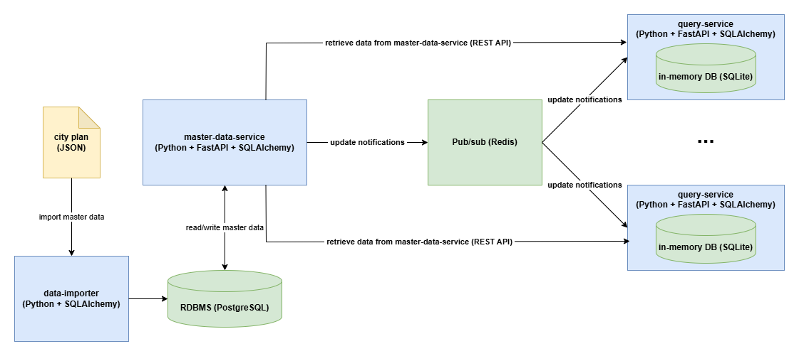

# City Navigator

## Introduction
City Navigator is an educational/experimental project for DevOps purposes. It is a simple application based on the microservices architecture, consisting of two microservices exposing REST API - **master data service** and **query service**. The application is a simplifed version of the backend for a portal providing services to passengers using public transport in a city. The master data service allows to manage information about the public transport. It can be used to create, update, delete, and read information about means of transport, stations, and lines (including itineraries). It is meant for some sort of administrators rather than passengers. The query service is meant for passengers, and it allows to serve queries concerning means of transport, stations, and lines (including itineraries). In addition, it can also be used to search journey plans. The underlying data model is very simple, it does not involve any schedules. Besides the above mentioned entities, it also stores information about the edges of the graph representing the city plan. The following diagram outlines the architecture of the application.


The query service is designed so that it should be horizontally scalable and thus capable of dealing with heavy load. Each instance of the service has its own in-memory database, which is initalized upon the start of the instance with data retrieved from the master data service. In order to keep the instances of the query service in sync with the master data, the master data service notifies all instances of the query service via Redis pub/sub whenever there is a change in the master data database (i.e. whenever an entity has been created, updated, or deleted). The journey plan search functionality is based on Dijkstra's shortest-path algorithm.

The application is instrumented with [Prometheus client for Python](https://pypi.org/project/prometheus-client/), so it can publish metrics to Prometheus. Both microservices collect the following metrics:
- number of HTTP (REST) requests for particular API endpoints (Prometheus counter)
- duration of HTTP (REST) requests for particular API endpoints (Prometheus histogram)
- number of failed HTTP (REST) requests for particular API endpoints (Prometheus counter)

In addition, the query service also collects the number of notifications from master data whose processing within the query service has failed (Prometheus counter).


## Repository Structure

```
City-Navigator/
├── application/                 # Application source code
│   ├── data-importer/           # Imports city plan data into PostgreSQL on startup
│   ├── http-service-discovery/  # HTTP service discovery for Prometheus (Docker Compose; both services)
│   ├── master-data-service/     # REST API for managing master data (CRUD)
│   ├── postgres/                # Custom PostgreSQL image with DB init scripts
│   └── query-service/           # REST API for passenger queries and journey planning
├── dev-ops/                     # DevOps assets
│   ├── docker-compose/          # Docker Compose deployment
│   └── minikube/                # Minikube-specific deployment and configuration
├── diagrams/                    # Diagram source files (draw.io)
└── test-automation/             # Test automation assets (functional API tests, load test)
```


## Quick Start

The Docker Compose deployment is the easiest way to run the application locally. The only prerequisite is Docker with the Compose plugin.

**1. Clone the repository**
```bash
git clone <repository-url>
cd City-Navigator
```

**2. Start the application**
```bash
cd dev-ops/docker-compose
docker compose up -d --wait
```

Docker Compose automatically initialises the PostgreSQL database, imports the city plan data via the data importer, and starts all services in the correct order.

The REST API is available via Nginx at `http://localhost`:
- Master Data Service: `http://localhost/city-navigator/api/master-data/`
- Query Service: `http://localhost/city-navigator/api/query/`
- Prometheus: `http://localhost:9090`
- Grafana: `http://localhost:3000` (admin / GrafanaSecret#37)

**3. Stop the application**
```bash
docker compose down
```


## Data Model

The application models public transport in a city using four entities:

| Entity | Description |
|---|---|
| **MeansOfTransport** | A mode of transport, e.g. `tram`, `bus`, `metro`. Identified by a short string identifier. |
| **Station** | A stop or station, identified by name. |
| **Line** | A transit line (e.g. `12`, `A`), referencing a MeansOfTransport and two terminal stations. |
| **Edge** | A directed connection between two stations on a specific Line, with a travel time in minutes. |

Lines are defined by their itineraries — a sequence of directed Edges connecting adjacent stations. The Edge graph is the basis for the Dijkstra shortest-path search in the Query Service. Note that edges are directed, so a bidirectional connection between two stations on the same line requires two edges (one in each direction).


## Tech Stack
Both microservices are implemented in Python using [FastAPI](https://fastapi.tiangolo.com/) and [SQLAlchemy](./https://www.sqlalchemy.org/). SQLite is used to implement the in-memory database for the query service. PostgreSQL is used as the master data database in the Docker Compose deployment. As mentioned before, Redis is used as pub/sub for the notifications sent by the master data service to the query service instance(s). At runtime, [Gunicorn (Green Unicorn)](https://gunicorn.org/) is used as application server. The Dockerfiles which are part of the project configure the server to run in multi-process mode. The above mentioned Prometheus instrumentation is implemented in a way able to deal with the multi-process model properly.


## Building Docker Images

The Docker Compose and Minikube deployments use pre-built images published to Docker Hub under the `jardo72` namespace. No local build is required to run the application.

If you want to build the images yourself — for example after modifying the source code — run the following commands from the `application/` directory. Each service has its own `Dockerfile`:

```bash
# data-importer
docker build -t jardo72/city-navigator-data-importer:latest application/data-importer

# master-data-service
docker build -t jardo72/city-navigator-master-data-service:latest application/master-data-service

# query-service
docker build -t jardo72/city-navigator-query-service:latest application/query-service

# http-service-discovery
docker build -t jardo72/city-navigator-http-service-discovery:latest application/http-service-discovery

# postgres (custom image with init scripts)
docker build -t jardo72/city-navigator-postgres:latest application/postgres
```

On Windows, the [build-and-push-images.cmd](./application/build-and-push-images.cmd) script builds and pushes all images in one step.


## DevOps
The [dev-ops](./dev-ops) directory is supposed to concentrate various DevOps assets accompanying the application like definition of CI/CD pipelines, IaC configurations etc.

## Test Automation
The [test-automation](./test-automation) directory is supposed to concentrate test automation assets accompanying the application.
