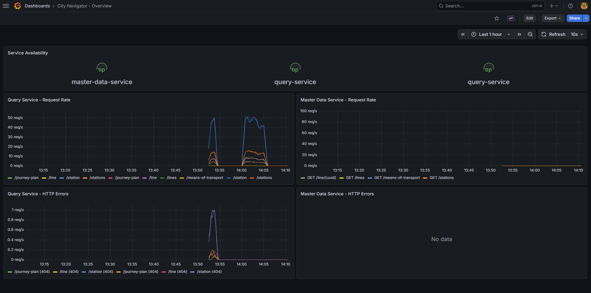
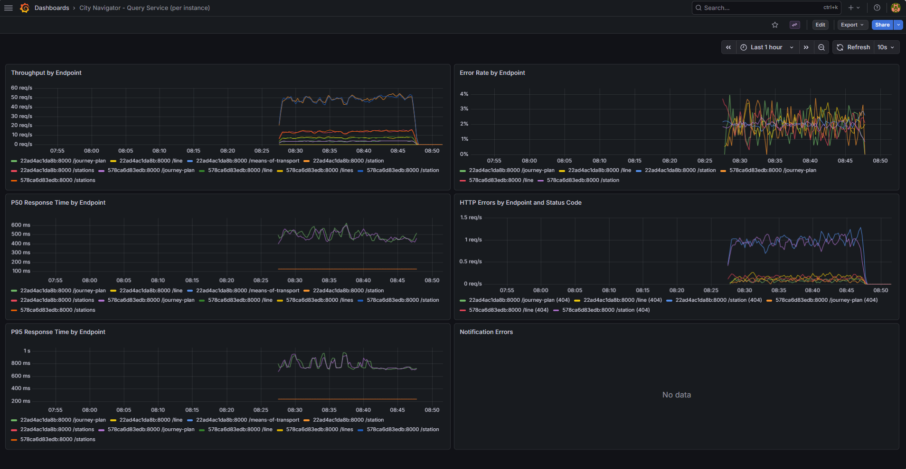
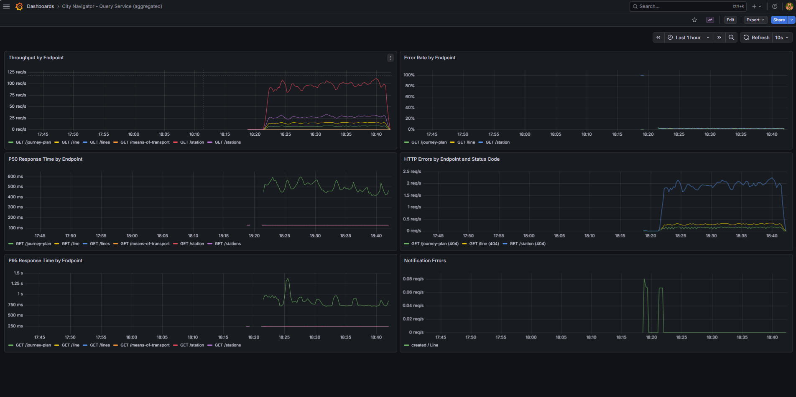

# Local Development with Docker Compose
The Docker compose deployment is a simple deployment primarily meant for local development. The deployment is illustrated by the following diagram:


This deployment involves a single instance of each of the two microservices comprising the application. In addition, it involves some additional containers:
- Nginx server serving as proxy. All REST requests sent to any of the two microservices are sent to the Nginx server. The server is configured with forwaring rules which direct each request to the proper microservice based on the resource path.
- PostgreSQL database used as the persistent store for the master data service.
- Data importer, a one-shot container that populates the PostgreSQL database with city plan data on startup.
- Redis serving as pub/sub messaging used to deliver notifications from the master data service to all query service instances.
- Prometheus server configured to scrape metrics from both microservices.
- Prometheus HTTP discovery service allowing Prometheus to discover all instances of the microservices, even in deployments with two or more instances of any of the service.
- Grafana configured to use Prometheus and (optionally) Loki as data sources.

The following containers are optional and only started when the `logging` profile is activated:
- Loki — log aggregation backend.
- Promtail — log collector that reads structured application logs from a shared volume and forwards them to Loki.


## Prerequisites

- Docker with the Compose plugin


## Starting and Stopping

Start all services (without the logging stack):
```bash
docker compose up -d --wait
```

Start all services including the Loki + Promtail logging stack:
```bash
docker compose --profile logging up -d --wait
```

Docker Compose handles the startup ordering automatically: PostgreSQL starts first and becomes healthy, then the data importer runs and populates the database, and only then the master data service starts. The `--wait` flag makes the command block until all services have started successfully.

Stop all services:
```bash
docker compose down
```


## Service Dependencies

Docker Compose starts services in the order determined by their `depends_on` declarations. The diagram below shows the full dependency graph, including the condition type for each dependency (`service_healthy`, `service_completed_successfully`, or `service_started`).


The most notable aspects of the startup ordering:
- The data importer waits until PostgreSQL passes its health check before running (`service_healthy`).
- The master data service waits until the data importer finishes successfully (`service_completed_successfully`), ensuring the database is populated before the service accepts requests.
- All other dependencies use `service_started`, meaning Docker Compose only waits for the container to be running, not for the application inside to be ready.


## Services and Ports

| Service | Host Port | Description |
|---|---|---|
| Nginx | 80 | Reverse proxy — entry point for the REST API |
| Prometheus | 9090 | Metrics scraping and query UI |
| Grafana | 3000 | Dashboards (admin / GrafanaSecret#37) |
| HTTP Service Discovery | 9099 | Prometheus HTTP SD endpoint |
| Loki *(logging profile)* | 3100 | Log aggregation backend |

PostgreSQL, Redis, the data importer, the two microservices, and Nginx are on an internal `service-network` and are not directly exposed to the host (except Nginx on port 80). Prometheus, Grafana, Loki, and Promtail share a separate `monitoring-network`.


## Nginx HTTP Router

Nginx serves as the single entry point for all REST API requests. The configuration is in [./nginx/nginx.conf](./nginx/nginx.conf). Routing rules:

| URL prefix | Forwarded to |
|---|---|
| `/city-navigator/api/master-data/` | `master-data-service:8000` |
| `/city-navigator/api/query/` | `query-service:8000` |

The configuration includes a `resolver 127.0.0.11 valid=30s` directive pointing at Docker's embedded DNS server. For the query service location, the upstream address is passed via a variable rather than as a literal hostname. This forces Nginx to re-resolve the hostname through Docker's DNS on each request (subject to the 30-second TTL), rather than caching a single IP at startup. As a result, traffic is distributed across all running query service replicas, which matters when scaling the query service to more than one instance.


## Redis Pub/Sub

Redis is used exclusively for pub/sub notifications from the master data service to the query service. Whenever an entity is created, updated, or deleted in the master data database, a notification is published on the `city-navigator` channel. Each query service instance subscribes to this channel and applies incremental updates to its in-memory database.


## Prometheus Server

Configuration is in [./prometheus](./prometheus). Prometheus uses the HTTP Service Discovery service to discover scrape targets dynamically — both microservices register themselves with it on startup.


## Prometheus HTTP Service Discovery

A lightweight FastAPI service that maintains a registry of running microservice instances and exposes it in the format required by Prometheus HTTP SD. Both microservices register with it at startup. Exposed on host port 9099.


## Grafana

Grafana is pre-provisioned with a Prometheus data source and three dashboards. The provisioning configuration is in [./grafana](./grafana). Default credentials: `admin` / `GrafanaSecret#37`.

**City Navigator - Overview** provides a high-level health view across both microservices, with all metrics aggregated across instances: service availability (gauge), request rate, P50 and P95 latency, and HTTP error rate — each shown for both services side by side.



**City Navigator - Query Service (per instance)** provides a detailed per-endpoint, per-instance breakdown intended for use during load tests: throughput, error rate, P50 and P95 response times, HTTP errors broken down by endpoint and status code, and notification errors from the Redis pub/sub channel.



**City Navigator - Query Service (aggregated)** shows the same panels as the per-instance dashboard but with metrics aggregated across all running query service instances. This is the primary view for monitoring overall query service health when running with multiple replicas.




## Structured Application Logging (Loki + Promtail)

The three Python services (master-data-service, query-service, http-service-discovery) write structured JSON application logs to the [./app-logs](./app-logs) directory via a `RotatingFileHandler` (10 MB per file, 5 backups). Each service produces its own log file:

| Service | Log file |
|---|---|
| master-data-service | `app-logs/master-data-service.log` |
| query-service | `app-logs/query-service.log` |
| http-service-discovery | `app-logs/http-service-discovery.log` |

Each log entry is a JSON object with `timestamp`, `level`, `logger`, and `message` fields (plus `exception` when an exception is logged).

When the `logging` profile is active, Promtail collects these files and forwards them to Loki. Grafana is pre-provisioned with Loki as a second data source alongside Prometheus, so logs can be explored in the Explore view or correlated with metrics in dashboards. Log files are gitignored; see [./app-logs/README.md](./app-logs/README.md).


## HTTP Access Logs

HTTP access logs for all three services (master-data-service, query-service, http-service-discovery) are written to the [./access-logs](./access-logs) directory, which is bind-mounted into each container. These are separate from the structured application logs described above. Log files are gitignored; see [./access-logs/README.md](./access-logs/README.md).
