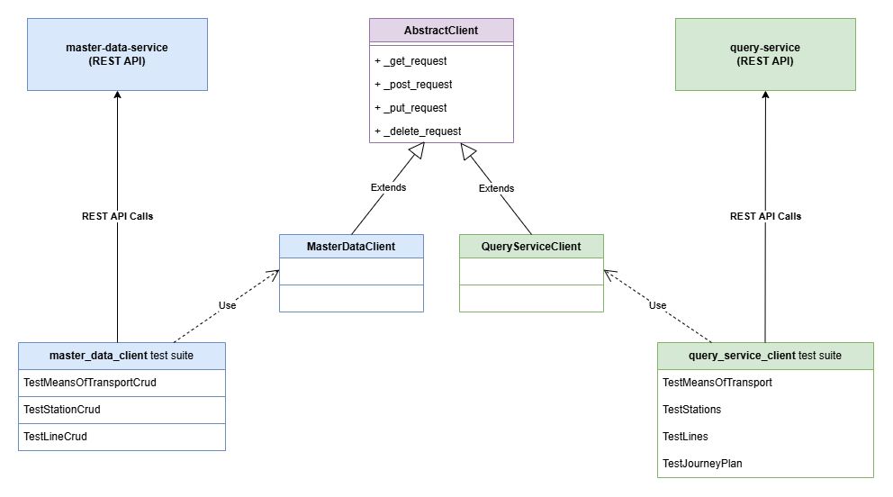
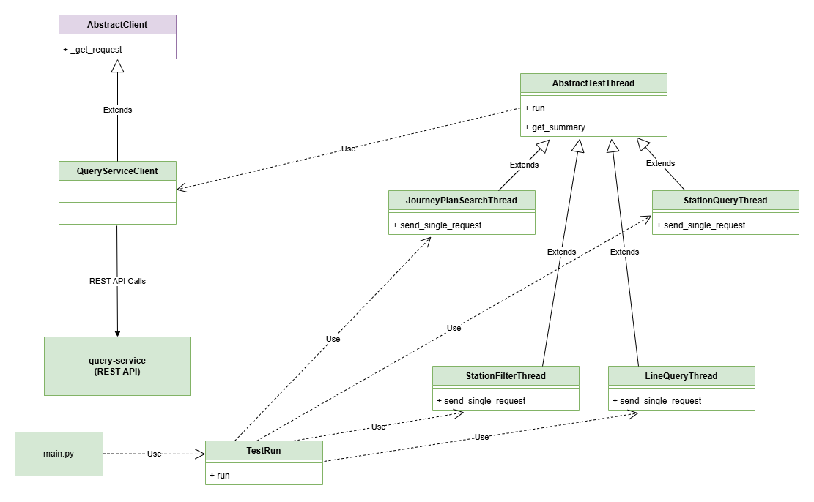
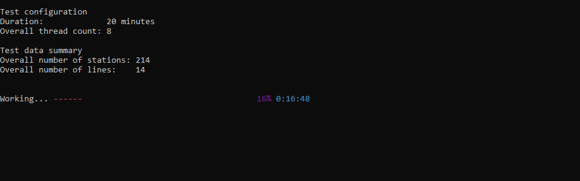
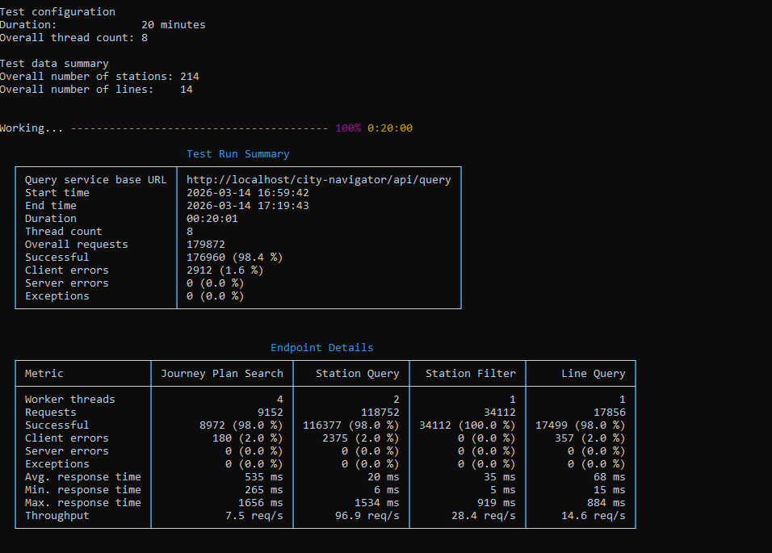

# Test Automation

## API Tests

The `tests/` directory contains pytest-based functional API tests that run against a live deployment. They require the Docker Compose stack to be up with the city plan data loaded (see the [docker-compose README](../dev-ops/docker-compose/README.md)).

The diagram below illustrates the structure of the functional API tests — the REST client hierarchy, the pytest fixtures, the test classes, and their relation to the services under test.



### What is tested

**Master Data Service** (`test_master_data_service.py`):
- Full CRUD lifecycle for stations: create → read → update → read → delete → 404
- Full CRUD lifecycle for means of transport
- Line creation with itinerary, read, and delete (with prerequisite entity setup and cleanup)
- 404 on non-existent UUIDs for all entity types

**Query Service** (`test_query_service.py`):
- Means of transport list contains all four types (U-Bahn, S-Bahn, Tram, Bus)
- Station list and wildcard filter (`Karl*`)
- Station detail by name; 404 for unknown station
- Line list, filter by means of transport, line detail by label
- Journey plan: `Karlsplatz → Stephansplatz` via U1 (2 min)
- Journey plan: `Westbahnhof → Stephansplatz` via U3 (7 min)
- 404 for unknown start or destination

### Prerequisites

```bash
python -m venv .venv
source .venv/bin/activate   # on Windows: .venv\Scripts\activate
pip install -r requirements.txt
```

### Running the tests

From the `test-automation/` directory:
```bash
pytest tests/
```

By default the tests connect to `http://localhost/city-navigator/api/...` (the Docker Compose Nginx). Override with environment variables:
```bash
MASTER_DATA_BASE_URL=http://localhost/city-navigator/api/master-data \
QUERY_SERVICE_BASE_URL=http://localhost/city-navigator/api/query \
pytest tests/
```


## Load Test

The `main.py` script is a custom multi-threaded load test for the Query Service. It spawns configurable numbers of worker threads, each continuously calling one Query Service endpoint for a specified duration, then prints a summary of throughput, response times, and error rates per endpoint.

The diagram below illustrates the structure of the load test — the client and thread class hierarchies, the `TestRun` orchestrator, and how `main.py` ties them together.



### Endpoints exercised

| Thread pool | Endpoint called |
|---|---|
| Journey plan search | `GET /journey-plan?start=<name>&destination=<name>` |
| Station query | `GET /station?name=<name>` |
| Station filter | `GET /stations?filter=<pattern>` |
| Line query | `GET /line?label=<label>` |

Station names, line labels, and means-of-transport identifiers are read from the Query Service at the start of the test run and used as input for the worker threads. Each thread picks values at random from those lists.

### Prerequisites

```bash
python -m venv .venv
source .venv/bin/activate   # on Windows: .venv\Scripts\activate
pip install -r requirements.txt
```

### Running the load test

```bash
python main.py <config-file> [-s <summary-output-file>]
```

Example using the provided test configurations for Docker Compose deployment:
```bash
python main.py docker-compose-test-cfg/load-test-cfg.json
python main.py docker-compose-test-cfg/load-test-cfg.json -s results.html
```

The `-s` option saves the summary as an HTML file in addition to printing it to stdout. The HTML file preserves the colours and table formatting from the terminal output.

### Example output

During the test run the terminal shows the test configuration, the test data summary (station and line counts fetched from the Query Service), and a progress indicator with percentage complete and time remaining:



Once the run finishes, the summary is printed. It contains overall request counts and error rates, followed by a per-endpoint breakdown of throughput and response times:



### Configuration file format

The configuration is a JSON file. Example (`docker-compose-load-test-cfg.json`):

```json
{
    "query_service_base_url": "http://localhost/city-navigator/api/query",
    "test_duration_minutes": 20,
    "journey_plan_search_threads": 4,
    "journey_plan_error_percentage": 2,
    "line_query_threads": 1,
    "line_query_error_percentage": 2,
    "station_query_threads": 2,
    "station_query_error_percentage": 2,
    "station_filter_threads": 1
}
```

| Field | Required | Description |
|---|---|---|
| `query_service_base_url` | yes | Base URL of the Query Service (without trailing slash) |
| `test_duration_minutes` | yes | How long each thread runs after it has been started |
| `journey_plan_search_threads` | yes | Number of threads calling `/journey-plan` |
| `journey_plan_error_percentage` | no | % of journey plan requests that intentionally use a non-existent station (to generate 4xx errors) |
| `line_query_threads` | yes | Number of threads calling `/line` |
| `line_query_error_percentage` | no | % of line requests that use a non-existent label |
| `station_query_threads` | yes | Number of threads calling `/station` |
| `station_query_error_percentage` | no | % of station requests that use a non-existent name |
| `station_filter_threads` | yes | Number of threads calling `/stations` with a random wildcard filter |
| `gradual_load_increase` | no | When present, threads are started gradually instead of all at once (see below) |

Set any thread count to `0` to skip that endpoint entirely.

#### Gradual load increase

The optional `gradual_load_increase` object enables a ramp-up phase before the steady-state load:

```json
"gradual_load_increase": {
    "duration_minutes": 5,
    "steps": 12
}
```

| Field | Required | Description |
|---|---|---|
| `duration_minutes` | yes | Total ramp-up duration; threads are spread evenly across this window |
| `steps` | no | Number of batches to split the threads into (defaults to the total thread count, i.e. one thread per step) |

Each thread runs for the full `test_duration_minutes` from its own start, so total wall time equals ramp-up duration plus test duration.

### Test configurations for Docker Compose deployment

The `docker-compose-test-cfg/` directory contains four ready-to-use test configurations, all targeting `http://localhost/city-navigator/api/query` with a 20-minute test duration:

| File | Description |
|---|---|
| `load-test-cfg.json` | Heavy mixed load — 4 journey-plan threads, 2 station-query threads, 1 line-query thread, 1 station-filter thread; 2% error rate on journey-plan, line-query, and station-query |
| `moderate-load-with-errors-cfg.json` | Moderate mixed load — 1 thread per endpoint; 1% error rate on journey-plan, line-query, and station-query |
| `moderate-load-without-errors-cfg.json` | Moderate mixed load — 1 thread per endpoint; no intentional errors (clean traffic only) |
| `short-moderate-load-without-errors-cfg.json` | Short moderate mixed load — 1 thread per endpoint; no intentional errors; 2-minute duration (quick smoke/regression check) |
| `pure-journey-plan-search-load-test-cfg.json` | Journey-plan stress test — 8 journey-plan threads only, all other endpoints disabled, no errors |

### Test configurations for Rancher deployment

The `rancher-test-cfg/` directory contains ready-to-use test configurations targeting `http://city-navigator.jch/api/query` (the Rancher ingress hostname):

| File | Description |
|---|---|
| `load-test-cfg.json` | Heavy mixed load — 9 journey-plan threads, 1 station-query thread, 1 line-query thread, 1 station-filter thread; 1% error rate on journey-plan, line-query, and station-query; 20-minute duration |
| `moderate-load-without-errors-cfg.json` | Moderate mixed load — 1 thread per endpoint; no intentional errors; 30-minute duration |
| `short-moderate-load-without-errors-cfg.json` | Short moderate mixed load — 1 thread per endpoint; no intentional errors; 2-minute duration (quick smoke/regression check) |
| `pure-journey-plan-search-load-test-cfg.json` | Journey-plan stress test — 12 journey-plan threads only, all other endpoints disabled, no errors; 20-minute duration |
| `gradual-load-peak-cfg.json` | Peak mixed load with gradual ramp-up — 9 journey-plan threads, 1 station-query thread, 1 line-query thread, 1 station-filter thread; no intentional errors; 12-minute test duration preceded by a 5-minute ramp-up (one thread started every 25 seconds) |
